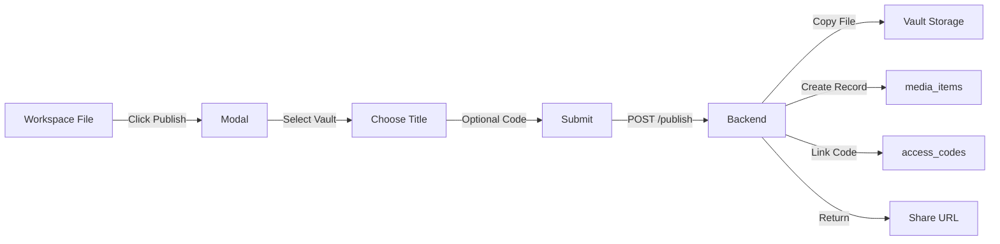

# Workspaces — Implementation Status Report

**Status:** ✅ Implemented
**Completed:** 2026-02-19
**Commit:** `52a1067`

---

## What Was Implemented

A complete **personal workspace management system** that allows users to create private workspaces for organizing files, with the ability to publish files to vaults for sharing.

### Core Features Delivered

#### 1. Workspace Management
- **Create/edit/delete workspaces** — each workspace is isolated per user
- **File browser UI** — navigate folders, upload files, create directories
- **File type support** — Markdown, BPMN, PDF, YAML, JSON, text files
- **Workspace metadata** — name, description, creation tracking

#### 2. File Viewers & Editors
- **Markdown preview** — GitHub-style rendering with syntax highlighting
  - View mode by default (rendered HTML)
  - "Edit" button switches to Monaco editor
  - "Toggle Raw" and "Copy" buttons
- **BPMN viewer/editor** — visual process diagram editing
- **PDF viewer** — PDF.js integration
- **Monaco text editor** — for all text-based files (YAML, JSON, etc.)
- **Theme support** — all viewers/editors follow light/dark theme

#### 3. Publish to Vault
- **One-click publishing** — copy workspace file to vault with single button
- **Vault selector** — choose destination vault from user's vaults
- **Access code support** — optional access code for secure sharing
- **Auto-slugification** — generates URL-safe slugs from titles
- **Share URLs** — instant shareable links after publishing

#### 4. Quality of Life
- **BPMN template** — new `.bpmn` files auto-populated with valid XML
- **Upload progress** — visual feedback for file/folder uploads
- **Breadcrumb navigation** — easy navigation through folder hierarchy
- **File count badges** — shows item counts in folders

---

## Technical Architecture

### New Crate: `workspace-manager`

```
crates/workspace-manager/
├── src/
│   ├── lib.rs            — routes, handlers, state
│   ├── file_browser.rs   — directory listing logic
│   └── file_editor.rs    — safe file operations
└── templates/
    └── workspaces/
        ├── list.html              — workspace list
        ├── new.html               — create workspace form
        ├── dashboard.html         — workspace overview
        ├── browser.html           — file browser UI
        └── markdown_preview.html  — MD preview template
```

### Database Schema

**Migration:** `014_workspaces.sql`

```sql
CREATE TABLE workspaces (
    id INTEGER PRIMARY KEY AUTOINCREMENT,
    workspace_id TEXT NOT NULL UNIQUE,
    user_id TEXT NOT NULL,
    name TEXT NOT NULL,
    description TEXT,
    created_at TEXT NOT NULL DEFAULT (datetime('now')),
    updated_at TEXT
);
```

**Storage layout:**
```
storage/
└── workspaces/
    └── {workspace_id}/
        ├── workspace.yaml
        ├── docs/
        ├── diagrams/
        └── ...
```

### API Routes

| Method | Route | Purpose |
|--------|-------|---------|
| GET | `/workspaces` | List user's workspaces |
| GET | `/workspaces/new` | Create workspace form |
| POST | `/api/user/workspaces` | Create workspace |
| GET | `/workspaces/{id}` | Workspace dashboard |
| GET | `/workspaces/{id}/browse/{path}` | File browser |
| GET | `/workspaces/{id}/edit?file={path}` | Open file (smart dispatch) |
| GET | `/workspaces/{id}/edit-text?file={path}` | Force Monaco editor |
| POST | `/api/workspaces/{id}/files/new` | Create file |
| POST | `/api/workspaces/{id}/files/upload` | Upload files |
| POST | `/api/workspaces/{id}/mkdir` | Create folder |
| DELETE | `/api/workspaces/{id}/files?path={path}` | Delete file/folder |
| POST | `/api/workspaces/{id}/files/save-text` | Save text file (Monaco) |
| POST | `/api/workspaces/{id}/bpmn/save` | Save BPMN diagram |
| GET | `/api/workspaces/{id}/files/serve?path={path}` | Serve raw file |
| **POST** | **`/api/workspaces/{id}/files/publish`** | **Publish to vault** |

### File Type Routing

When opening a file via "Open" button:

| Extension | Handler | Mode |
|-----------|---------|------|
| `.bpmn` | BPMN Viewer | View + edit mode |
| `.pdf` | PDF.js Viewer | View only |
| `.md`, `.markdown` | Markdown Preview | View + "Edit" button |
| Other text | Monaco Editor | Direct edit |

---

## Code Reuse & Integration

### Leveraged Existing Crates

1. **docs-viewer** — exported `MarkdownRenderer` for reuse
2. **bpmn-viewer** — `BpmnViewerTemplate` for BPMN files
3. **pdf-viewer** — `PdfViewerTemplate` for PDFs
4. **common/storage** — `UserStorageManager` workspace methods

### Theme System Integration

All components follow site-wide light/dark theme:
- Monaco editor detects theme via `data-theme` attribute
- Markdown CSS uses DaisyUI theme variables (`oklch(var(--b2))`, etc.)
- Live theme switching with `MutationObserver`

---

## Publishing Workflow



**Backend flow:**
1. Verify workspace + vault ownership
2. Read file bytes from workspace
3. Generate unique slug from title
4. Copy to `storage/vaults/{vault_id}/documents/`
5. Create `media_items` record
6. Optionally create `access_codes` + `access_code_permissions`
7. Return shareable URL

---

## What's Different from Vault Folders (TODO)

| Feature | Workspaces (Implemented) | Vault Folders (TODO) |
|---------|-------------------------|----------------------|
| **Scope** | Personal file organization | Vault-wide organization |
| **Privacy** | Private to creator | Shared via vault access |
| **Purpose** | Draft/work area before publishing | Organize large vault collections |
| **Hierarchy** | Free-form folder structure | Structured folder tree with access control |
| **Publishing** | One-way: workspace → vault | N/A (folders ARE the organization) |
| **Access Control** | Owner only | Folder-level groups + access codes |

**Both can coexist:** Workspaces are for private work; vault folders organize published content.

---

## Files Modified

### New Files
- `crates/workspace-manager/` — entire crate (10+ files)
- `migrations/014_workspaces.sql` — database schema
- `docs/docs_design/WORKSPACES_STATUS.md` — this file

### Modified Files
- `crates/docs-viewer/src/lib.rs` — export `MarkdownRenderer`
- `crates/docs-viewer/templates/docs/editor.html` — theme-aware Monaco
- `crates/docs-viewer/templates/docs/view.html` — theme-aware CSS
- `crates/common/src/storage.rs` — workspace storage methods
- `src/main.rs` — integrate workspace routes
- `Cargo.toml`, `Cargo.lock` — workspace-manager dependency
- `templates/components/navbar.html` — add "Workspaces" link

---

## Workspace.yaml — Live Manifest ✅

**Implemented:** 2026-02-19

The `workspace.yaml` file serves as a **live manifest** and **metadata store** for workspace folders. It automatically syncs with filesystem changes and enables special-purpose folder types.

### Features
- **Auto-sync** — updates when folders created/deleted
- **Folder typing** — classify folders by purpose
- **Metadata storage** — custom properties per folder
- **Processor integration** — configuration for specialized handlers

### Folder Types Supported

| Type | Purpose | Status |
|------|---------|--------|
| `plain` | Regular file storage | ✅ Implemented |
| `static-site` | Static website projects | 🔲 Processor placeholder |
| `bpmn-simulator` | Process diagram execution | 🔲 Processor placeholder |
| `agent-collection` | AI agent definitions | 🔲 Processor placeholder |
| `documentation` | Docs projects (mdBook, etc.) | 🔲 Future |
| `data-pipeline` | ETL workflows | 🔲 Future |

### Example workspace.yaml

```yaml
name: "Engineering Workspace"
description: "Process models and agent workflows"

folders:
  agents:
    type: agent-collection
    metadata:
      agents:
        - file: coder.md
          role: code-generation
          model: claude-sonnet-4.5
      shared_context: context/docs.md

  website-project:
    type: static-site
    metadata:
      entry_point: index.html
      framework: hugo
      theme: minimal
```

### Processor Crates

Created placeholder crates for future folder processors:
- `crates/workspace-processors/static-site/` — Build static websites
- `crates/workspace-processors/bpmn-simulator/` — Execute BPMN diagrams
- `crates/workspace-processors/agent-collection/` — Manage AI agents

See `crates/workspace-processors/README.md` for architecture details.

---

## Known Limitations & Future Enhancements

### Current Limitations
- No collaborative editing (single-user workspaces)
- No version history or git integration
- Processor implementations are placeholders (not yet functional)
- Published files don't maintain link to workspace original

### Potential Future Enhancements
1. **Implement processors** — make folder types functional
2. **Workspace templates** — quick-start for common workflows
3. **Git integration** — commit/push from workspace UI
4. **Two-way sync** — update vault file updates workspace original
5. **Workspace sharing** — invite collaborators to workspace
6. **Import from vault** — pull vault file into workspace for editing
7. **Bulk publish** — select multiple files to publish at once

---

## Metrics

- **Lines of code:** ~3,200 (new workspace-manager crate)
- **Database tables:** 1 (workspaces)
- **API routes:** 15
- **Templates:** 5
- **Supported file types:** BPMN, PDF, Markdown, YAML, JSON, text
- **Development time:** ~1 session

---

## Success Criteria — All Met ✅

- [x] Users can create/manage personal workspaces
- [x] File browser with upload/download/delete
- [x] Markdown preview with edit mode toggle
- [x] BPMN diagrams work with new file templates
- [x] Publish workspace files to vaults with access codes
- [x] Theme-aware viewers/editors (light/dark mode)
- [x] No breaking changes to existing vault/media system
- [x] Clean code reuse (no duplication)

---

## Next Steps

The workspace system is feature-complete for v1. The next logical extension is **Vault Folders** (see `TODO_VAULT_FOLDERS.md`) — which will provide hierarchical organization WITHIN vaults to complement the workspace system.
