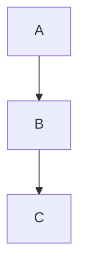

# Frontend UI — Architecture & Design System

> Last updated: 2026-03-15

The generated Astro frontend uses DaisyUI v5 + Tailwind CSS v4, with a component-based architecture. Shared framework code lives in `generator/static_files/src/`; per-site content is injected by the site generator.

---

## Directory Map

```
generator/static_files/src/
├── layouts/
│   ├── main.astro          – Main layout: fixed navbar, drawer sidebar, footer
│   ├── contentlayout.astro – Content/MDX layout: sticky navbar, prose, elements
│   └── _header.astro       – <head>: meta, fonts, theme init, Mermaid/KaTeX
├── components/
│   ├── page-renderer/
│   │   └── ElementRenderer.astro  – dispatches element objects to components
│   ├── page-elements/
│   │   ├── TitleHero.astro
│   │   ├── Hero.astro
│   │   ├── Hero2.astro
│   │   ├── Collection.astro
│   │   ├── StatData.astro
│   │   ├── Carousel.astro
│   │   ├── SlidingGallery.astro
│   │   ├── TeamGrid.astro
│   │   ├── Process.astro
│   │   ├── Presentation.astro
│   │   ├── MdText.astro
│   │   ├── TitleAlertBanner.astro
│   │   ├── NewsBannerSSG.astro
│   │   ├── DataCTA.astro
│   │   ├── DataSurvey.astro
│   │   └── Hello.astro
│   ├── utils/
│   │   ├── ThemeToggle.astro    – DaisyUI theme switcher (sun/moon)
│   │   ├── SearchBar.astro      – Fuzzy search modal trigger
│   │   └── PicFromContent.astro – Image resolver for content images
│   ├── CardDefault2.astro   – Card: 4:3 image + gradient overlay
│   ├── CardBlog.astro       – Card used in contentlayout header
│   ├── CardInfo.astro       – Card with SVG placeholder when no image
│   ├── MyNavFooter.astro    – Footer with wave, logo, links, social
│   ├── MyDrawerMenu.astro   – Sidebar drawer menu
│   └── FAQComponent.astro   – FAQ accordion
├── styles/
│   ├── global.css           – Tailwind + DaisyUI config, typography, scrollbar
│   ├── prose.css            – Prose overrides, details/summary, Mermaid reset
│   └── toc.css              – Table-of-contents sidebar styles
└── plugins/
    └── rehype-mermaid-blocks.mjs  – Remark plugin: mermaid code blocks → <pre class="mermaid">
```

---

## Theme System

### Themes

Configured per-site in `sitedef.yaml`:

```yaml
settings:
  themedark: "synthwave"    # any DaisyUI v5 theme
  themelight: "corporate"   # any DaisyUI v5 theme
```

The theme is stored in `localStorage` under the key `"theme"` and applied as `data-theme` on `<html>`. Switching is done by `ThemeToggle.astro`, which toggles between `themelight` and `themedark`.

**Initialization** (inline in `_header.astro`, runs before render to avoid flash):
```js
const savedTheme = localStorage.getItem("theme");
if (savedTheme === lightTheme || savedTheme === darkTheme) {
  document.documentElement.setAttribute("data-theme", savedTheme);
} else {
  document.documentElement.setAttribute("data-theme", lightTheme);
}
```

### Custom Themes

`global.css` also defines two custom themes (`venturepro` / `ventureprodark`) as examples. These use DaisyUI v5 `@plugin "daisyui/theme" { ... }` syntax with OKLCH colors.

---

## Typography

Fonts are loaded from Google Fonts in `_header.astro`:

| Role | Font | Weights |
|---|---|---|
| Headings (`h1`–`h6`, navbar) | **Syne** | 600, 700, 800 |
| Body | **Outfit** | 400, 500 |

Applied in `global.css`:
```css
:root {
  --font-heading: 'Syne', system-ui, sans-serif;
  --font-body: 'Outfit', system-ui, sans-serif;
}
body { font-family: var(--font-body); }
h1, h2, h3, h4, h5, h6 { font-family: var(--font-heading); }
```

`prose.css` applies the same font vars inside `.prose` content for MDX pages.

System font fallback is always included — the fonts are loaded async, so there is no font-blocking.

---

## Layouts

### `main.astro` — Pages

Used for pages driven by `page.json` elements (`index.astro`).

- **Navbar**: `position: fixed`, `bg-base-100/90 backdrop-blur-md`, `border-b border-base-300/30`
  - Left: hamburger menu (opens drawer), site name + logo
  - Right: SearchBar, ThemeToggle
- **Drawer**: slides in from left, contains `DrawerMenu`
- **Content**: `mt-20` to clear fixed navbar, `<slot />`
- **Footer**: `MyNavFooter`

### `contentlayout.astro` — MDX Content

Used for individual MDX entries rendered via `[...slug].astro`.

- **Navbar**: `sticky top-0`, `bg-base-100/90 backdrop-blur-md`, `border-b border-base-300/30`
  - No logo; left shows site name only
  - Right: SearchBar, ThemeToggle
- **CardBlog**: header card at top showing entry image/title/desc
- **Breadcrumbs**: Home > Collection > Entry title
- **`elements_above`**: MDX frontmatter array — elements rendered before prose
- **Prose slot**: centered, max-width, full mobile support
- **`elements_below`**: MDX frontmatter array — elements rendered after prose
- **FAQ**: rendered from `faqdata` frontmatter array
- **LikeButton** + Contact modal (via datatool)
- **TOC drawer**: optional, toggled by `showtoc: true` frontmatter

---

## Card Components

### `CardDefault2.astro`

Main collection card. 4:3 aspect image with text overlay.

- `card glass` + `shadow-xl`
- Image fills figure at `aspect-[4/3]`
- `bg-gradient-to-t from-black/95 via-black/75 to-transparent` overlay (bottom 2/3)
- Title, description, type tags inside overlay
- Badge (warning color) in top-right if `card.data.badge` present
- Draft overlay via `CardDraftOverlay.astro`

### `CardInfo.astro`

Same structure but with an SVG placeholder when no image is available.

### `CardBlog.astro`

Used in `contentlayout.astro` as the page header. Wider format, shows image + title + description.

---

## Navbar Styling Pattern

Both navbars share the same style pattern for visual consistency:

```html
<div class="navbar bg-base-100/90 backdrop-blur-md z-50 border-b border-base-300/30" ...>
```

- `bg-base-100/90` — 90% opaque, allows backdrop blur to show through
- `backdrop-blur-md` — frosted glass when content scrolls behind
- `border-b border-base-300/30` — subtle separator
- DaisyUI semantic colors only — no hardcoded grays

---

## Footer

`MyNavFooter.astro` uses only DaisyUI semantic colors (no hardcoded gray-*):

- Background: `bg-base-200`
- Text: `text-base-content`, `text-base-content/80`, `text-base-content/60`
- Links: `hover:text-primary`

The SVG wave separator at the top of the footer uses `text-base-200` fill (matches the footer bg).

---

## Prose Styling (`prose.css`)

Extends Tailwind Typography `.prose` class:

- Font family via CSS custom props (`--font-body`, `--font-heading`)
- Headings: `letter-spacing: -0.02em`
- Mobile: code blocks scroll horizontally, tables scroll, images constrained
- `details`/`summary`: custom `▶`/`▼` toggle indicator (used in MDX component docs)
- Mermaid: `pre.mermaid` background reset (transparent, no border/shadow)

---

## Mermaid Diagrams

MDX pages can use mermaid code blocks:

````

````

**How it works:**
1. `rehype-mermaid-blocks.mjs` (remark plugin) intercepts `code[lang=mermaid]` nodes before Shiki highlights them
2. Converts them to `<pre class="mermaid">diagram source</pre>` raw HTML
3. `_header.astro` loads Mermaid from CDN (`cdn.jsdelivr.net/npm/mermaid@11`) when `enablemermaid: true` in frontmatter
4. Mermaid initializes with theme matching the current DaisyUI theme (dark themes → `"dark"`, others → `"default"`)
5. A `MutationObserver` on `data-theme` re-renders diagrams on theme toggle, restoring source from `data-src`

**Enable in MDX frontmatter:**
```yaml
---
enablemermaid: true
---
```

---

## Search

`SearchBar.astro` provides client-side full-text search:

1. Fetches all entries from `searchableCollections` (configured in `sitedef.yaml`) at build time
2. Serializes as JSON, embeds in page
3. Trigger button opens a search modal
4. Client-side fuzzy matching via `SearchBarLoader` (preact component)

To make a collection searchable:
```yaml
collections:
  - name: demo
    searchable: true
```

---

## Adding a New Page Element

1. Create `generator/static_files/src/components/page-elements/MyElement.astro`
2. Use flat structure with legacy fallback:
   ```astro
   ---
   const title = element.title ?? element.content?.title ?? "";
   const myField = element.myField ?? element.props?.myField;
   ---
   ```
3. Register in `ElementRenderer.astro`:
   ```astro
   } else if (element.element === "MyElement") {
     return <MyElement element={element} index={index} lang={lang} />;
   }
   ```
4. Add a schema in `crates/site-generator/src/element_schemas.rs`:
   ```rust
   static MY_ELEMENT_FIELDS: &[FieldDef] = &[
       field!("title", required, String),
       field!("myField", optional, String),
   ];
   // Add to ELEMENT_SCHEMAS array:
   ElementSchema { element: "MyElement", description: "...", fields: MY_ELEMENT_FIELDS },
   ```

---

## Astro Config (`astro.config.mjs`)

Key integration points:
- Imports `siteConfig` from `./src/website.redirects.mjs` (auto-generated)
- `redirects: siteConfig.redirects` — page slug redirects
- Sitemap `i18n` driven from `siteConfig.defaultLocale` / `siteConfig.locales`
- Image service: `astro/assets/services/sharp`
- Plugins: Preact (icons + interactive), Vue, MDX, Sitemap, Tailwind (Vite)
- Math support: `remark-math` + `rehype-katex` (LaTeX in MDX)
- Mermaid: `remarkMermaidBlocks` custom plugin
- Path alias: `~/` → `./src/`
