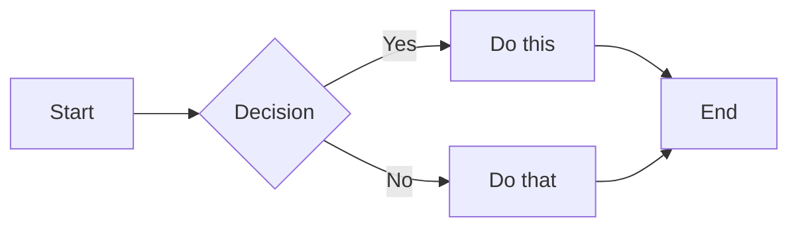
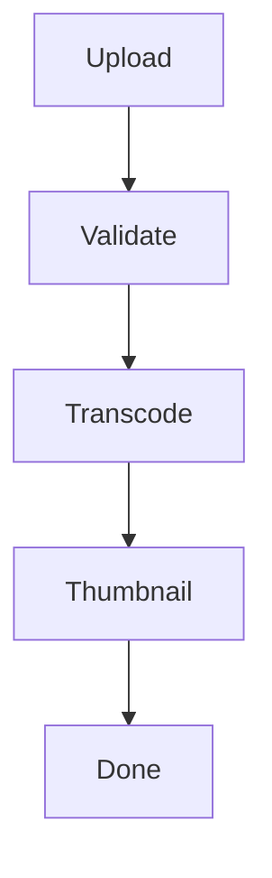
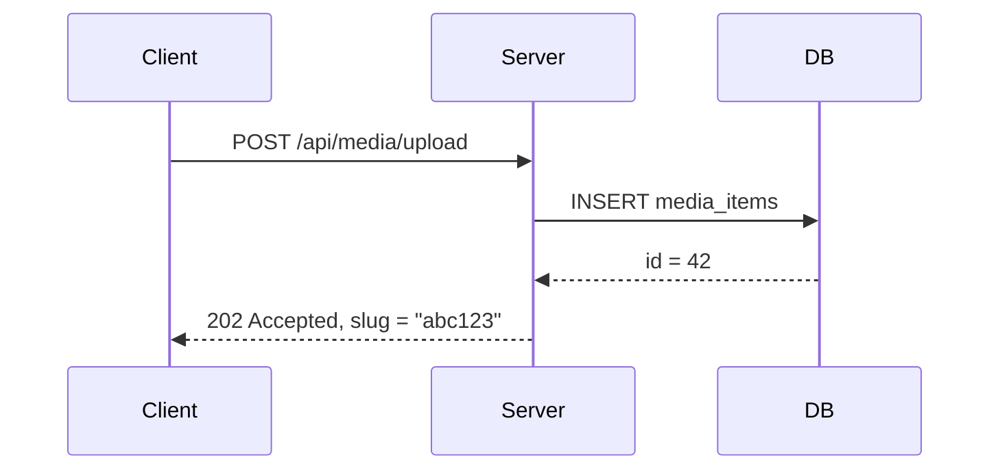
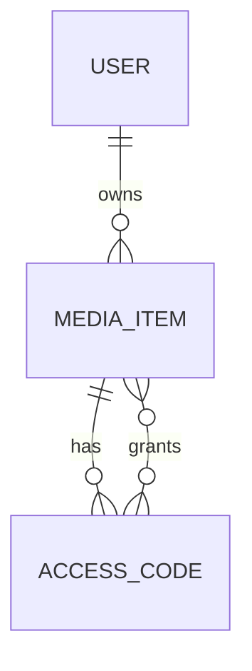
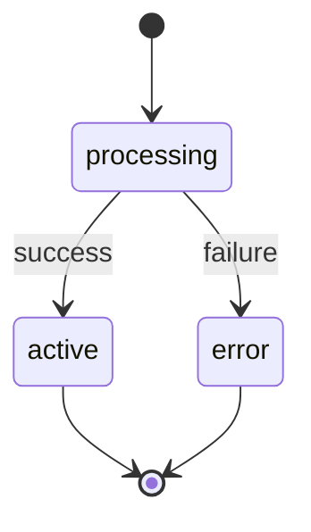
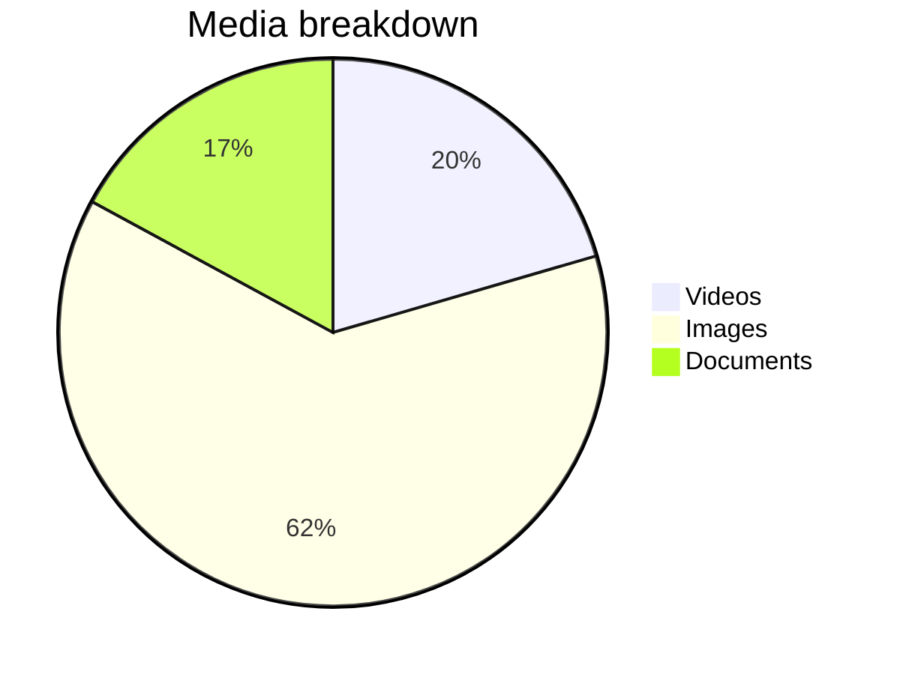
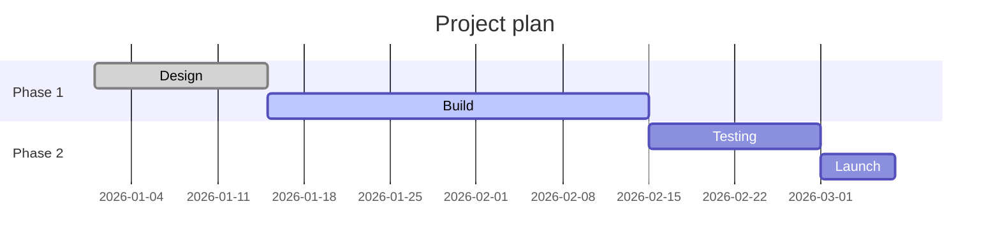

# Math and Diagrams in Markdown

Math formulas (via KaTeX) and flow diagrams (via Mermaid) are supported in all markdown contexts:

- **Docs viewer** (`/docs/`)
- **Media markdown files** (uploaded `.md` documents)
- **Course lessons** (workspace course folders)

---

## Math / LaTeX

### Inline math

Wrap with single `$...$`:

```
The energy equation $E = mc^2$ is fundamental to modern physics.

The standard deviation is $\sigma = \sqrt{\frac{1}{N}\sum_{i=1}^N (x_i - \mu)^2}$.
```

### Display math (block)

Wrap with double `$$...$$` on its own lines:

```
$$
\int_{-\infty}^{\infty} e^{-x^2} dx = \sqrt{\pi}
$$
```

```
$$
\mathbf{F} = m\mathbf{a}
$$
```

### Common notation

| What | Syntax | Output |
|---|---|---|
| Fraction | `\frac{a}{b}` | a/b |
| Square root | `\sqrt{x}` | √x |
| Power | `x^{2}` | x² |
| Subscript | `x_{i}` | xᵢ |
| Sum | `\sum_{i=1}^{n}` | Σ |
| Integral | `\int_{a}^{b}` | ∫ |
| Greek letters | `\alpha \beta \gamma` | α β γ |
| Infinity | `\infty` | ∞ |
| Matrix | `\begin{pmatrix} a & b \\ c & d \end{pmatrix}` | matrix |
| Bold vector | `\mathbf{v}` | **v** |

### Full example

```markdown
Given a dataset with $n$ observations, the mean is:

$$
\bar{x} = \frac{1}{n} \sum_{i=1}^{n} x_i
$$

The variance $\sigma^2$ measures spread around the mean:

$$
\sigma^2 = \frac{1}{n} \sum_{i=1}^{n} (x_i - \bar{x})^2
$$
```

### Notes

- KaTeX supports a large subset of LaTeX math. For a full list of supported functions see the [KaTeX docs](https://katex.org/docs/supported.html).
- Inline `$` must not have spaces immediately inside: `$x$` works, `$ x $` does not.
- If a `$` appears in normal text (e.g. a price), escape it: `\$49.99`.

---

## Mermaid Diagrams

Use a fenced code block with `mermaid` as the language:

~~~

~~~

### Diagram types

**Flowchart**

~~~

~~~

**Sequence diagram**

~~~

~~~

**Entity relationship**

~~~

~~~

**State diagram**

~~~

~~~

**Pie chart**

~~~

~~~

**Gantt / timeline**

~~~

~~~

### Notes

- Mermaid is rendered client-side. The raw diagram source is not visible to readers.
- Theme is set to `neutral` — it adapts to light/dark mode reasonably well.
- For full syntax reference see [mermaid.js.org](https://mermaid.js.org/intro/).

---

## Context-specific behaviour

| Context | Math delimiters | Mermaid |
|---|---|---|
| Docs viewer (`/docs/`) | `$...$` inline, `$$...$$` display | ` ```mermaid ` fenced block |
| Media markdown view | Same | Same |
| Workspace file preview (`/workspaces/…/edit?file=*.md`) | Same | Same |
| Course lesson | Same | Same |
| Presentation slides | Same (Reveal.js math plugin) | Not yet supported |

## Related

- [Markdown Docs Viewer (dev)](../dev/features/MARKDOWN_DOCS_VIEWER.md)
- [Course viewer](../apps/course-viewer.md)
